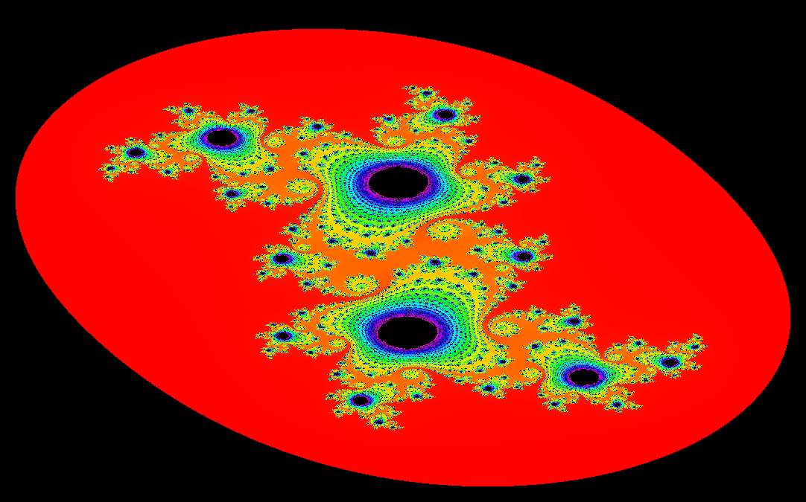
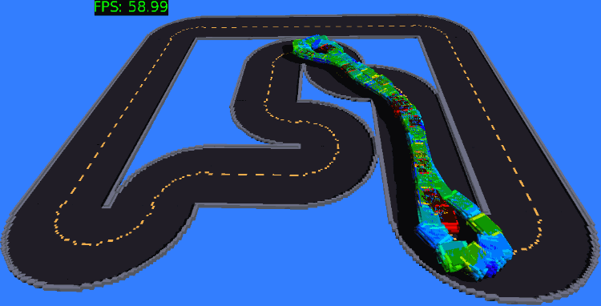

# Go Experiments
This repository contains a series of experimental projects to learn more about the Go programming language.

## Fractal Rendering

## Voxel Cars
Inspired from [this GitHub project](https://github.com/ArztSamuel/Applying_EANNs), these 
voxel cars use a genetic algorithm to teach a small fully-connected neural network how to navigate a course.

