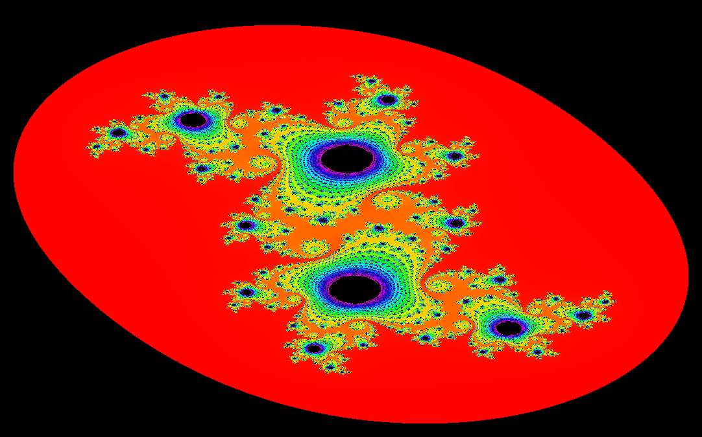
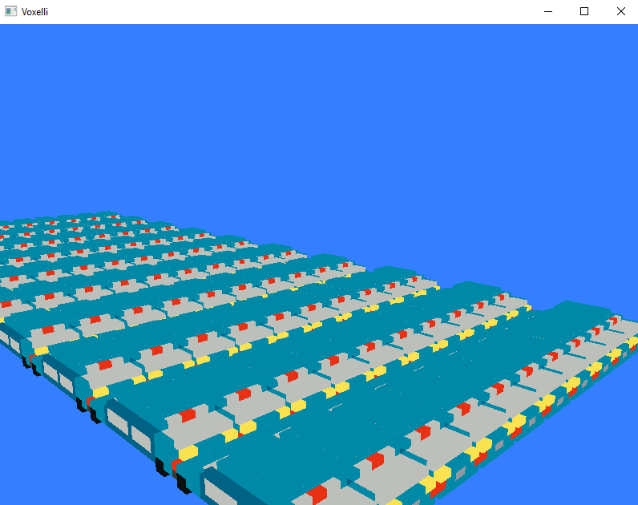

# Go Experiments
This repository contains a series of experimental projects to learn more about the Go programming language.

## Fractal Rendering

## Voxel Rendering

Rendering one hundred 1,640 voxel cars in a very inefficient manner

